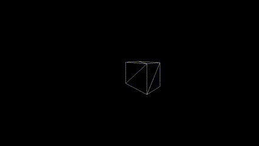
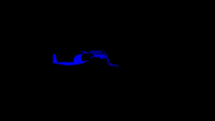

# Render Engine

# Dependencies
- Requires Windows OS
- Requires C++ 11 or above
- Ideally use Microsoft Visual Studio to build and run (I have not tested with other IDEs)

# Build and Run
- Either run using given cmake file or use Microsoft Visual Studio build system to compile and run
- Modify config.txt to get desired scene

# Overview
	Originally this was going to be a project where I build a software rasterizer.
	However, I realized that it would be more beneficial and make more sense to
	go ahead and just build through the whole graphics pipeline from object file processing to
	rasterization.
	This is done entirely on the CPU side of things, no graphics API or shader files are used.
	As a result, all operations are done sequentially rather than in parallel (it's slower, but easier
	to understand).

# Config
	Edit config.txt to define scene
	Very self explanitory on how to add or remove options
	Can configure lighting, models, and colors
	Can also configure wirframe mode and perspective projection paramteres

# Features and Previews
- Gyroscopic camera (rotates on own axis)
- configurable scene (add different models at different positions)
- wireframe mode and basic lighting
- plane clipping and culling
- depth buffering

## Wireframe Models (clipping and culling)

## Preconfigured Scene

# The Process (getting more in depth)
## Window and resizing
	One main goal with the project was to use as few libraries as possible,
	so while I could've easily used window creation libraries, I decided to use
	the built in windows window creation api.
	Every frame the windows draws from a buffer array that defines each pixel color
	this buffer is modified by drawing functions, it then clears this buffer and the window
	When resizing it is important to make sure the the buffer is not drawn to the screen while resizing
	operations are occuring.  Thus I use a simple mutex lock to prevent different message threads
	from drawing to the buffer while resizing is occuring.
	There is no possibility of deadlock since there is only one resource being aquired
## Drawing a line
	This program uses Bresenham's line drawing algorithm for line drawing
	This entails an accumulation of error on y over each x to determine changes needed in y
	There is also a linear interpolation of color values and pixel depth values on each pixel of the line
## Loading a model
	This program uses Wavefront obj files.  However, some features of such files are not supported in this program.
	One thing that does happen is that any polygon with more than 3 vertices is clipped
	using the ear clipping method
	Face normals are also generated from given normals
	If no normals are given normals will be generated using a very greedy approach (this approach fails with concavity)
## Local to world transformation
	When loading a model we ensure that it is centered around the origin and its vertices
	are normalized from -1 to 1.
	Transforming from local coorinates to world coordinates is as simple as
	moving the center of this object to the desired position, then scaling and
	rotating the model based on scene defined parameters
	This can all be done with simple vector-matrix multiplications which result in an output
	vector of new points of each vertex
	It is also important to note that normals need to be rotated with the model
## Quaternion rotation
	An important thing to understand with rotations in this program is that they are all done
	with quaternions.  In this context we can think of quaternions as a 4-dimensional number reperesentation
	that allows for rotation about a defined axis.
	There are a bunch of really good resources for understanding quaternion rotation,
	but the important things to understand are that the angle of rotation is defined as the
	real part of the quaternion and the imaginary parts represent either the direction of the axis to
	rotate about or the position of the points to modify
## Camera projection
	In this program we use a lookat matrix to transform the vertices of a model
	such that the origin of the world is the camera's position.
	This is done by keeping track of the up, right, and forward direction vectors of the camera.
	Given that information we can map the world axes to the camera axes.  This is
	essentially a rotation of the object in world space
	This is done for normal vectors as well, however vertices need to be transformed
	using the position of the camera.  This is simple as transforming by the negative
	difference between the camera position and the origin.
## Perspective projection
	Our eyes see objects as smaller the further away from the camera they are
	To simulate this, this program has a very simple projection matrix.
	Essentially, there we want the view box to expand from a front plane and a
	far plane in the z-axis.  This is done by a simple fov angle.
	The math is pretty easy to find online for scaling x and y.
	An important thing to note is that the projection happens in two steps.
	The vector is extended to length 4 and the multiplication allows for the
	original z coordinate to be stored in the output vector.
	This is then divided by the stored z coordinate to normalize values.
## Back-face culling and triangle clipping
	If the angle of a face normal and the vector from the face to the camera
	is greater than or equal to 90 degrees then the face is not going to be drawn,
	thus we can exclude it.
	For triangle clipping we check if the triangle is out of the view box,
	If the triangle is out of view we have to move the vertices of the triangle
	and the normals for those vertices such that we either end up with zero, one, or two
	new triangles.
	The problem with this is that is slow when it cannot be done in parallel,
	however trying to draw outside the window when vertex values blow up will be slower.
## Drawing wireframe
	For wireframe drawing it is as simple as drawing lines between each
	vertex.  It is very nice to test clipping and culling with this.
## Lighting
	This program uses a very simple lighting model.  The color of the surface is simply
	multiplied by the normalized dot product between the vector from the surface to
	the light and the face normal.  We iterate through each light in the
	scene and add each contribution.
	An important thing to understand is that colors are represented as 32-bit
	unsigned integers split up into 8-bit RGB values.  These 8-bit values must
	be between 0 and 255, so operations must take this into account.
## Rasterizing triangles
	To rasterize triangles, the program uses a very greedy approach.
	First we find the x and y bounds of the triangle, then for each pixel
	in that bounding box, we use barycentric coordinates to determine whether
	the pixel is in the triangle or not.
	The barycentric approach also allows for scaling of depth and color values
	based on its proximity to each vertex.

# Possible additions
- Texturing (this wouldn't be too hard given how triangles are rasterized in this program)
- curves
- better rasterization (faster)
- more lighting options
